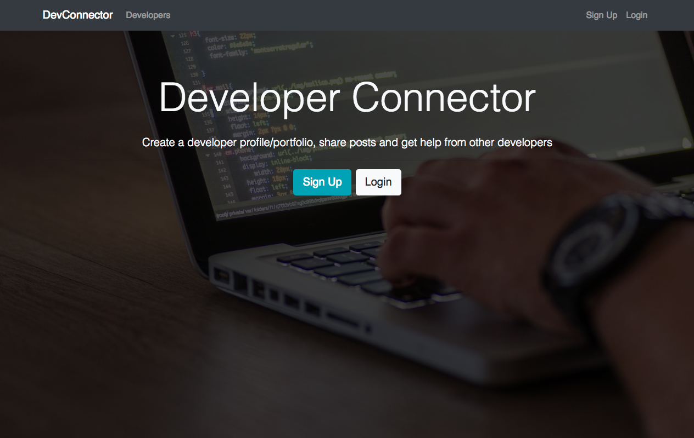

# [DevConnector](https://mern-dev-connector.herokuapp.com/)

DevConnector is a small social network for developers alike. This application features an authentication system, profiles, post feed and GitHub information.

## Preview



**[View Live Preview](https://mern-dev-connector.herokuapp.com/)**

## Download and Installation

To begin using this application, choose one of the following options to get started:

* Clone the repo: `git clone https://github.com/costaleonardo/mern-dev-connector.git`
* [Fork, Clone, or Download on GitHub](https://github.com/costaleonardo/mern-dev-connector)

## Usage

```bash
# Install dependencies for server
npm install

# Install dependencies for client
npm run client-install

# Run the client & server with concurrently
npm run dev

# Run the Express server only
npm run server

# Run the React client only
npm run client

# Server runs on http://localhost:5000 and client on http://localhost:3000
```

You will need to create a keys_dev.js in the server config folder with

```
module.exports = {
  mongoURI: 'YOUR_OWN_MONGO_URI',
  secretOrKey: 'YOUR_OWN_SECRET'
};
``

## Bugs and Issues

Have a bug or an issue with this template? [Open a new issue](https://github.com/costaleonardo/mern-dev-connector/issues) here on GitHub.

## Copyright and License

This project is licensed under the [MIT](https://opensource.org/licenses/MIT) License.

